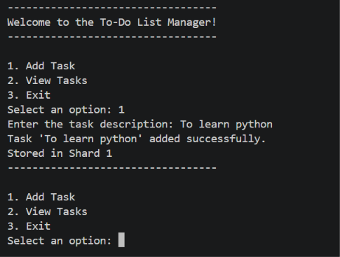
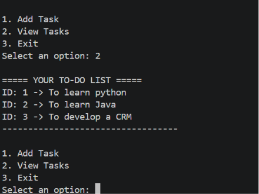

# DecodeLabs Project 1 - To-Do List Manager

## Features
- Add Tasks
- View Tasks
- Automatic Task IDs
- JSON Data Persistence
- Sharded Storage Simulation

## Technologies Used
- Python
- JSON
- Git
- GitHub
## Screenshots

### Adding a Task

### Viewing Tasks

## Author
Yashashwin

